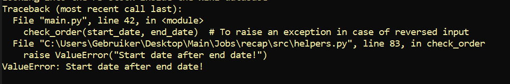

# Introduction and Overview of features

This small trivial CLI app has been built over the course of 6 hours during my vacation (excl. vacation-related distractions). As requested, the four tasks below were tackled:

<p> - <b> Make a CLI App </b> 


<p> - <b> Calculate stock returns </b> 


<p> - <b> Calculate maximum drawdown</b>


<p> - <b> Generate 7-day forecasts (see plots folder) </b>  


The above four main goals were successfully fulfilled with the below features:

<p> - <b> Exception handled and safe user input (for basic edge cases only considering the limited time I had)</b> 





<p> - <b> Stock data retrieval from the Nasdaq API</b> 
<p> - <b> Interactive user experience</b> 
<p> - <b> local saving of all plots and data in a tidy fashion</b> 
<p> - <b> Maximum drawdown plots (see plots folder)</b> 
<p> - <b> Forecasting (and plotting) across user-defined periods and stocks</b> 
<p> - <b> Model benchmarking with automated basic transformations (log and Boxcox)</b> 


# Relevant Contents

All contents of the code base are outlined in this section

## Scripts

<p> - <b> requirements.txt: </b> contains dependencies for the CLI app to run
<p> - <b> src/main.py: </b> Used to run the CLI and call other modules
<p> - <b> src/tool.py: </b> Contains the StockTool class which houses all calculations and app logic 
<p> - <b> src/helpers.py: </b> Contains helper functions which create folders for the output, parse .env files, handle exceptions and more


## Folders

<p> - <b> src/creds: </b> contains .env file with API key, the folder is empty but the key has been sent to you in a separate email
<p> - <b> src/data: </b> app-generated folder which contains the data retrieved from the API
<p> - <b> src/preds: </b> app-generated folder which contains the forecasts
<p> - <b> src/plots: </b> app-generated folder which contains the plots of the forecasts and the maximum drawdown
<p> - <b> RM_IMGs: </b> Contains images parsed in this README file

I would recommend running the app separately without the app-generated folders to see the process!

# How to run

From your terminal, when in the src folder, first install required libraries with the -r flag, using this in a virtual conda environment is of course, highly recommended:

```
pip install -r requirements.txt
```

Then the CLI can be invoked with help messages as such:

```
python main.py -h
```
The helper messages will guide you through the rest! Where the only user input required is a series of Y/N answers. Eveyrthing is exception handled from start to finish. If you wish to reproduce the contents of the included app-generated folders, you can use the below arguments I used for development and testing:

```
python main.py -start 2015-01-01 -end 2015-02-28 -database WIKI -dataset FB
python main.py -start 2010-01-01 -end 2020-01-01 -database WIKI -dataset FB
python main.py -start 2015-01-01 -end 2015-02-28 -database WIKI -dataset TSLA
python main.py -start 2010-01-01 -end 2020-01-01 -database WIKI -dataset TSLA
```
Feel free to attempt breaking the app and play with it at your convenience!


# Model Choice

The model used is an ARIMA (Autoregressive integrated moving average) which are useful models when data shows non-stationarity, a property which generally holds for stock time series data. More complex forecasting models such as LSTMs were not necessary in this case since the use case as we are only predicting short-term stocks (7 days). It is therefore not necessary to use forget gates or other similar sequence models such as RNNs. 

<br>

Additionally, pmdarima can automatically choose the auto-regressive (AR) and moving average (MA) parameters of the ARIMA which means we can infer trends and seasonality automatically, this is ideal considering the amount of freedom given to the user in choosing stocks and start/end dates. Futhermore, transformations were implemented automatically which can be used to further improve performance (the CLI app first trains a non-transformed benchmark model and later on chooses the best model post-transformations). Statistical tests were implemented to automatically infer which transformation is the best with the data at hand. Therefore ARIMA was chosen over more complex models such as RNNs or LSTMs because of the short forecast window, while other simpler models such ETS (exponential smoothing) could not be implemented because of the need of a human in the loop to tune parameters.

<br>

Finally, common evaulation metrics were used: RMSE to evaluate predictions, AIC and BIC as our information criterions. RMSE was used instead of other time series metrics such as MAE or MAPE because of the higher penalties given to trends towards the end of the series, a property which is very useful for our generalized CLI app. AIC and BIC are used under pmdarima's hood to optimize for simpler models that hold the most information possible (therefore minimizing AIC and BIC).


# Reservations/discussion

Considering I was still on holidays and the time window provided, many things are still left to be done despite having a working CLI app. The first reservation is the lack of automated testing using pytest for instance to catch as many edge cases as possible. Second, the ARIMA model performs poorly when more than 2 years of data are provided, although the RMSE, BIC and AIC are satisfactory, the forecast plots are almost linear. My guess is that this issue is caused by poor design of the fourier term (m), although we infer seasonality automatically, the performance of the inference drops when we look at more data in the past where potential seasonal patterns emerge which we fail to capture and instead generalize to a line. Finally, some cosmetic issues with the plots were not fixed as well as unncessarily verbose code in the last class method (arima).

<br>

Please do not hesitate to send me an email in the case of any questions, issues and/or doubts!

<br>

Kind regards, <br>
Adam
